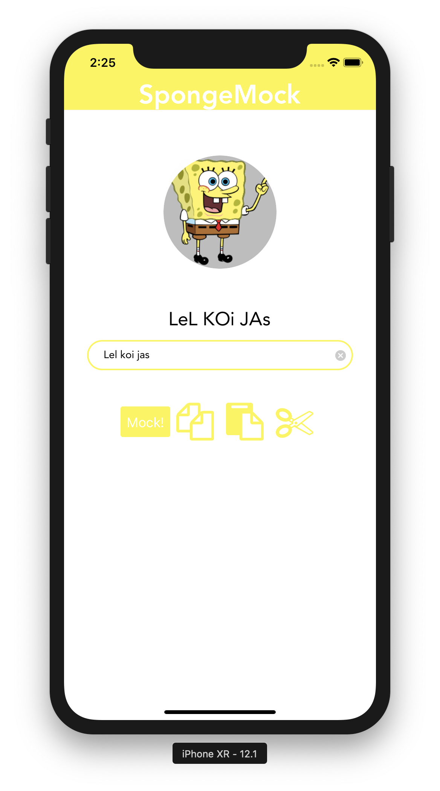

# SpongeMock
A cross platform mobile application based on [spongemockify](https://github.com/maacpiash/spongemockify) by [maacpiash](https://github.com/maacpiash). You can read more about the module on that repo.

## Download
**Android APK(signed) :** [https://expo.io/artifacts/4169ae2e-d9e9-4e3b-b391-464e2ef38b14](https://expo.io/artifacts/4169ae2e-d9e9-4e3b-b391-464e2ef38b14)


**iOS:** For some voodoo magical reasons, expo build process doesn't work with 2FA, so couldn't build.

## App features
- Click on `Mock!` button to get the mocked text.
- You can then copy the mocked text to clipboard.
- Also you can paste text from clipboard and mock it.

## Instructions to run the dev version
- Install Expo app on your iOS / Android Phone.
- Install the Expo CLI on your dev machine

```bash
npm i -g expo-cli
```
- Clone the repo and `cd` into it
- Make sure to have `yarn` installed! You can use `npm` as well if you want.
- Then: 

```bash
yarn install
# or,
npm install

yarn start
# for iOS
yarn run ios
# for Android
yarn run android
```

- Let the expo server run and generate a QR code for you. (In case you don't have an emulator / simulator, you can run the app on your device using this QR code. Just scan it.)
- You have it!

## Screenshot
Dedicated to [Raiyan aka Lel Khan](https://github.com/raiyan106). 😂



## License
MIT
